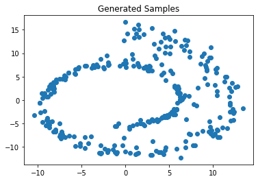
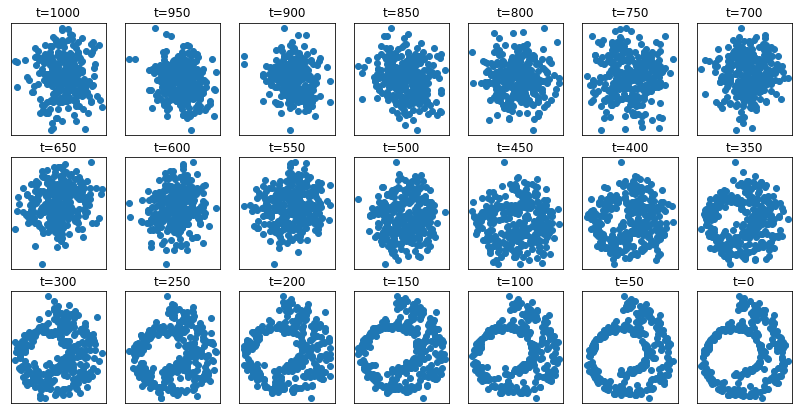

# basic_diffusion_model

My implementation of the basic diffusion model for the swiss roll dataset.
Mostly working off of [https://lilianweng.github.io/posts/2021-07-11-diffusion-models/](https://lilianweng.github.io/posts/2021-07-11-diffusion-models/) and the papers cited there.

There are probably mistakes, may update as I learn more about diffusions models.
I just use a basic DNN for the reverse model, could be more optimally designed.

#### Generated Samples

#### Sample Generation Process
